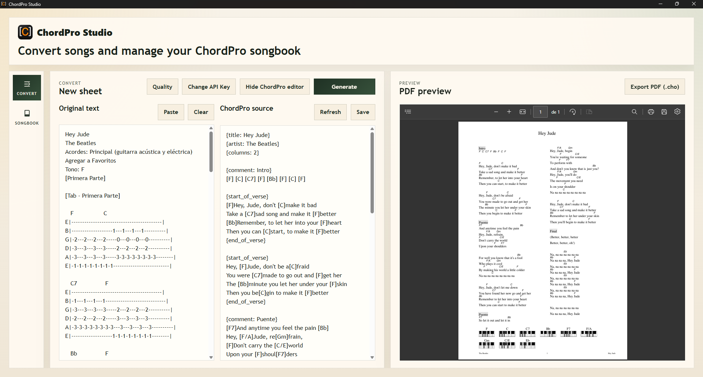
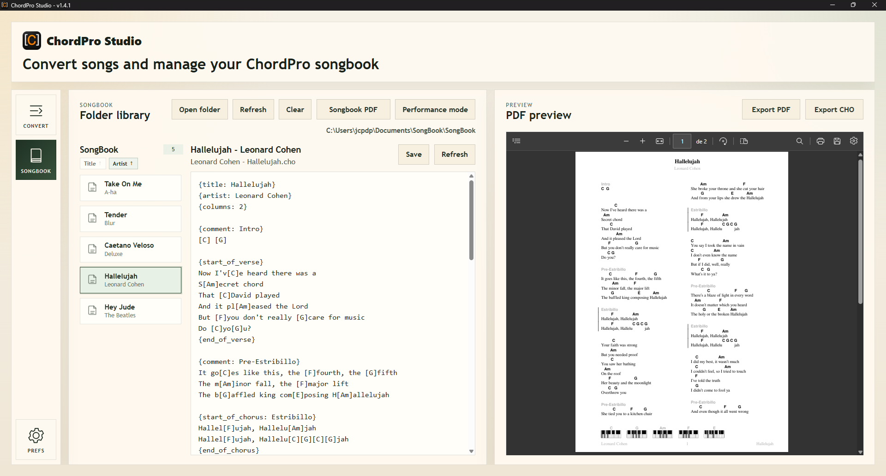
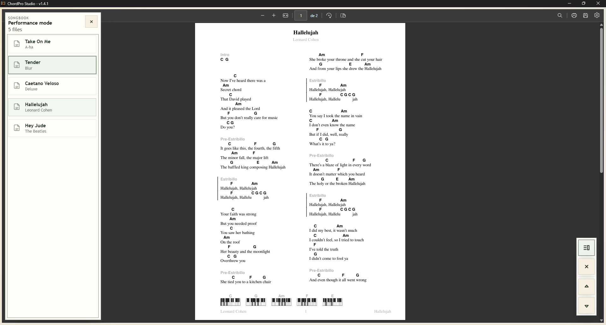

# ChordPro Studio

## Description

ChordPro Studio is a desktop application for turning raw chord sheets into valid ChordPro, previewing the result with the real ChordPro CLI renderer, and exporting or managing songs as part of a local songbook.

It is intended for musicians who work with lyrics and chords, want a faster way to normalize song sheets, and prefer a local desktop workflow over a browser-based tool.

Core idea:

`raw chord sheet -> valid ChordPro -> preview/export`

The current release is a Tauri desktop app with an offline-first design for local files and rendering. Network access is only needed for the LLM conversion step.

This project is primarily a personal tool, shared publicly in its current state.  
It may evolve over time, but no guarantees are provided.

## Features

- LLM-assisted conversion from raw chord sheets to valid ChordPro
- PDF preview generated with the bundled ChordPro CLI
- PDF export and `.cho` export from the same ChordPro source
- Filesystem-based songbook workflow for opening, editing and saving `.cho` files
- Songbook browsing and Performance mode for local playback/reading workflows
- Local-first desktop workflow with shared workspace state
- User-managed Gemini API key stored in local app config
- Desktop application built with Tauri

## Screenshots

## Installation

For the current Windows release (`v1.6.0`), you can use any of these artifacts:

1. `ChordProStudio-v1.6.0.msi`
2. `ChordProStudio-v1.6.0-setup.exe`
3. `ChordProStudio-v1.6.0.zip`

If you use the `.zip` package:

1. Extract it to a local folder.
2. Run `ChordPro Studio.exe`.

## Usage

1. Open the app.
2. Set your Gemini API key from the UI.
3. Paste a chord sheet into the input area.
4. Generate ChordPro from the raw text.
5. Review the PDF preview and export to `.pdf` or `.cho` as needed.

You can also open a local folder of `.cho` files, edit songs directly in the Songbook view, and use Performance mode for reading/navigation.

## Configuration

- A Gemini API key is required for generation.
- The API key is stored locally in the app config file as `config.json`.
- The key is not encrypted in v1.
- You can set, change, or clear the key from the application UI.

Other local preferences, such as conversion mode and the last opened songbook folder, are also stored in the local app config.

## Third-Party Components

This project redistributes ChordPro as part of the desktop app bundle.

- Component: ChordPro
- Official repository: https://github.com/ChordPro/chordpro
- Version used in this repository: `6.090.1`
- Official Windows artifact used for the bundled runtime: `ChordPro-Installer-6-90-1-2-msw-x64.exe`
- License: Artistic License 2.0
- Full license text included at `THIRD_PARTY_LICENSES/ChordPro.txt`
- Upstream LICENSE copy included at `THIRD_PARTY_LICENSES/ChordPro-upstream-LICENSE.txt`

Source availability:

- ChordPro source code is available from the official repository above.
- The bundled runtime in this repository was recreated from the official `R6.090.1` release artifact.

## Privacy & Security Notes

- Your Gemini API key is stored locally in plain text as a v1 design decision.
- The app does not use a project backend or hosted database.
- Song files, previews, and exports are handled locally on your machine.
- Network requests are only made to the configured LLM provider during conversion.

## Limitations

- Generation requires a valid API key.
- The current release does not include auto-update.
- The current bundled runtime and release flow are Windows-focused.
- This is still an early v1 release.
- The developer Playground exists in the codebase but is hidden in production builds.

## Tech Stack

- Vue 3
- TypeScript
- Vite
- Tauri
- ChordPro CLI

## Known Issues

- Windows SmartScreen may show a warning because the application is not code-signed.

## License

This project is licensed under the MIT License. See `LICENSE`.

Third-party components, including ChordPro, are distributed under their own licenses.
